# Teams Copilot Agent Deployment Architecture

This document provides a detailed breakdown of the deployment architecture and flow for the Teams Copilot Agent. It covers both the **User POV** (the onboarding wizard steps and manual configurations) and the **Technical POV** (internal API calls, provisioning, package modification, and flow patching).

---

## 1. User POV Deployment Flow

The User POV diagram illustrates the step-by-step experience of the administrator deploying the agent using the Onboarding Wizard and Azure/Teams portals.

```mermaid
flowchart TD
    %% Styling Definitions
    classDef start fill:#e8f5e9,stroke:#2e7d32,stroke-width:2px;
    classDef step fill:#e1f5fe,stroke:#0288d1,stroke-width:1px;
    classDef action fill:#ffe0b2,stroke:#f57c00,stroke-width:2px;
    classDef final fill:#e8f5e9,stroke:#388e3c,stroke-width:2px;

    %% Nodes
    Start([1. Start Wizard]) --> Step1[Step 1: Retrieve Skysecure App ID<br/>Copy Client ID from wizard sidebar]
    
    Step1 --> Step2Input[Step 2: Enter Tenant ID]
    Step2Input --> Step2Consent[Click 'Grant Admin Consent'<br/>Accept permissions in browser window]
    
    Step2Consent --> Step3[Step 3: Assign Contributor Role<br/>Open Azure Portal -> IAM<br/>Assign Contributor role to Skysecure App ID]
    
    Step3 --> Step4Fetch[Step 4: Fetch Resources<br/>Click 'Connect & Fetch Azure Resources'<br/>Validate Contributor role & choose RG]
    
    Step4Fetch --> Step4Form[Fill Configuration<br/>Environment ID, SharePoint URL]
    Step4Form --> Step4Trigger[Click 'Start Onboarding']
    
    Step4Trigger --> Step5Modal{Device Code Modal Popup?}
    Step5Modal -- Yes --> Step5Auth[Step 5: Authenticate Power Platform<br/>Copy code, open Microsoft page, and log in]
    Step5Auth --> Step6Success
    Step5Modal -- No / Active Profile --> Step6Success[Onboarding Successful Modal]
    
    Step6Success --> Step6Download[Download Manifest ZIP]
    Step6Download --> Step6Upload[Step 6: Upload to Teams Admin Center<br/>Open admin.teams.microsoft.com -> Manage apps<br/>Upload Manifest ZIP]
    
    Step6Upload --> Step7Consent[Step 7: Manual Connection Consent<br/>Open copilotstudio.microsoft.com -> Agent Settings<br/>Click 'Connect' on inactive connections]
    
    Step7Consent --> Complete([8. Deployment Live & Active in Teams])

    %% Class assignments
    class Start start;
    class Step1,Step2Input,Step4Fetch,Step4Form,Step4Trigger,Step6Success,Step6Download step;
    class Step2Consent,Step3,Step5Auth,Step6Upload,Step7Consent action;
    class Complete final;
```



### User Step-by-Step Experience

1. **Start Wizard & Copy App ID**: The user opens the onboarding wizard in their browser, notes the preconfigured Skysecure Service Principal Client ID, and copies it.
2. **Grant Admin Consent**: The user enters their Tenant ID. The "Grant Admin Consent" button becomes active. Clicking it redirects the user to the Microsoft Entra ID admin consent flow, registering the Skysecure multitenant app in the customer's tenant and authorizing required API permissions.
3. **Assign Contributor Role**: The user navigates to the Azure Portal, opens the target resource group, and assigns the **Contributor** role to the Skysecure App ID in the Access Control (IAM) settings.
4. **Configure & Deploy**: 
   - User clicks "Connect & Fetch Azure Resources". The wizard backend verifies the Contributor role assignment and queries subscriptions and resource groups to populate the dropdowns.
   - User selects the Subscription and Resource Group, inputs the target Power Platform Environment ID, and customer site SharePoint URL. (Note: Customer Slug is hardcoded to `skysecure`, Agent Slug to `docgen`, and Bot Display Name to `docgen agent`).
   - User clicks "Start Onboarding".
5. **Device Code Authentication**: The deployment script runs in the background. If a login prompt is needed for the Power Platform API, a "Device Code Auth Modal" pops up in the wizard. The user copies the code, opens the Microsoft device login link, and signs in.
6. **Download & Upload Teams Manifest**: Upon completion, a Success Modal appears. The user downloads the generated Teams Manifest `.ZIP` file. They then open the **Teams Admin Center** (`admin.teams.microsoft.com`), navigate to **Teams apps** > **Manage apps**, click **Upload new app**, and upload the zip package.
7. **Copilot Studio Connection Consent**: Finally, the user opens `copilotstudio.microsoft.com`, selects their environment, opens the deployed agent, navigates to Settings -> Connections, and clicks **Connect** to authorize any inactive connections (like the Copilot Studio agent connector).

---

## 2. Technical Aspect Deployment Flow

The Technical POV diagram details the orchestrator endpoints, Azure ARM templates, Dataverse configurations, and PowerShell interactions.

```mermaid
flowchart TD
    %% Styling Definitions
    classDef core fill:#e8eaf6,stroke:#3f51b5,stroke-width:2px;
    classDef azure fill:#e0f7fa,stroke:#00acc1,stroke-width:2px;
    classDef pac fill:#ede7f6,stroke:#5e35b1,stroke-width:2px;
    classDef power fill:#fce4ec,stroke:#d81b60,stroke-width:2px;
    classDef data fill:#efebe9,stroke:#8d6e63,stroke-width:2px;

    %% Steps
    subgraph Discovery ["1. Azure Discovery & Permission Validation"]
        D1[GET /api/azure/sp-details] -->|Returns SP Client ID| D2[Frontend]
        D2 -->|Admin Consent URL redirect| Entra[Microsoft Entra ID]
        Entra -->|Registers Enterprise App in Customer Tenant| D2
        D2 -->|GET /api/azure/subscriptions| D3[Orchestrator Backend]
        D3 -->|ClientSecretCredential Auth| Entra
        Entra -->|Validate Contributor permissions| SubList[List Subscriptions]
        D2 -->|GET /api/azure/resource-groups| RGList[List Resource Groups]
    end

    subgraph Init ["2. Onboarding Initialization"]
        RGList -->|POST /api/onboard| RunPs[Spawn onboard_customer.ps1 in background]
        RunPs -->|Logs stream| WS[WebSocket /api/onboard/logs/{task_id}]
    end

    subgraph ScriptAuth ["3. Script Authentication"]
        RunPs -->|POST client_credentials| Entra
        Entra -->|Access Tokens| Tokens[Azure SPN Token & PowerApps SPN Token]
    end

    subgraph AzureProvision ["4. Azure Infrastructure Deployment"]
        Tokens -->|POST /deployments| Orch[Orchestrator Service]
        Orch -->|ARM Template 1 Deployment| CA[Container App]
        Orch -->|ARM Template 2 Deployment| Bot[Azure Bot Service Registered]
        Orch -->|Poll Status| DeployStatus[Deployment succeeded]
        DeployStatus -->|Return FQDN| RunPs
    end

    subgraph ManifestGen ["5. Teams Manifest Generation"]
        Orch -->|teams_manifest.py| GenManifest[Generate manifest.json]
        GenManifest -->|Inject Bot Client ID & Container App FQDN| ZipPack[Zip with icons: manifest.zip]
        ZipPack -->|Save| GenDir[orchestrator/generated_manifests/]
    end

    subgraph ConnectorConfig ["6. Connector Swagger Customization & Import"]
        RunPs -->|pac solution unpack| Unpack[Extract Connector Zip]
        Unpack -->|Inject Container App FQDN into host field| SwapSwagger[swagger_openapidefinition.json]
        SwapSwagger -->|pac solution pack| Pack[Repacked documentConnector_injected.zip]
        Pack -->|pac solution import| ImpConnector[Import Connector to Power Platform]
    end

    subgraph ConnSetup ["7. Dataverse Connection Creation"]
        ImpConnector -->|POST devicecode| Entra
        Entra -->|Log user code in WS| UserAuthModal[Frontend Device Code Modal]
        UserAuthModal -->|Poll for token| UserToken[Fetch User Access Token]
        UserToken -->|pac solution create-settings| SetJson[Generate settings.json]
        UserToken -->|GET apis list| QueryDV[Query Dataverse APIs]
        QueryDV -->|Resolve Custom Connector API name| PUTConn[PUT Dataverse Connection]
        PUTConn -->|Bind connection ID| SetJson
    end

    subgraph AgentPublish ["8. Agent Import & Publish"]
        SetJson -->|pac solution import with settings.json| ImpAgent[Import Agent Solution]
        ImpAgent -->|pac solution publish| Pub[Publish Solutions]
    end

    subgraph WebhookPatch ["9. Flow Webhook & Env Variable Update"]
        Pub -->|GET flows list| FlowQuery[Fetch Flow: docgen flow]
        FlowQuery -->|POST listCallbackUrl| GetURL[Retrieve Webhook Trigger URL]
        GetURL -->|PATCH container app env| CAUpdate[Update Container App: COPILOT_FLOW_URL]
    end

    subgraph Success ["10. Download & Finalize"]
        CAUpdate -->|ZERO-TOUCH ONBOARDING COMPLETE| SuccessModal[Frontend Success Modal]
        SuccessModal -->|GET /api/manifest/{agent_slug}/{customer_slug}| Download[Download Manifest ZIP]
    end

    %% Class Assignments
    class D1,D2,WS,UserAuthModal,SuccessModal,Download core;
    class D3,Orch,CA,Bot,DeployStatus,CAUpdate azure;
    class Unpack,Pack,ImpConnector,ImpAgent,Pub pac;
    class Entra,Tokens,UserToken,SetJson,FlowQuery,GetURL power;
    class SubList,RGList,QueryDV,PUTConn data;
```

### Technical Workflow Details

1. **Azure Discovery & Permission Validation**:
   - The wizard queries the client details via `/api/azure/sp-details`. 
   - Admin consent is requested from Entra ID (`https://login.microsoftonline.com/{tenant_id}/adminconsent`), which registers the Enterprise App under the customer's directory.
   - When fetching Azure resources, `/api/azure/subscriptions` initializes a `ClientSecretCredential` with Skysecure's App ID and Secret, requesting access tokens. If the Contributor role is assigned, subscriptions are retrieved; otherwise, a 500/permission error is raised.
2. **Onboarding Initialization**:
   - The user triggers onboarding, which calls `/api/onboard` with the hardcoded slugs (Customer: `skysecure`, Agent: `docgen`) and bot display name (`docgen agent`).
   - The orchestrator backend runs `onboard_customer.ps1` as a background process and streams progress logs to the frontend using WebSockets.
3. **Script Authentication**:
   - The Powershell script retrieves OAuth tokens from Entra ID scoped for Azure Resource Management (`https://management.azure.com/.default`) and PowerApps (`https://api.powerapps.com/.default`) using the Service Principal client credentials. The docker image tag utilized is hardcoded as `v1`.
4. **Azure Infrastructure Deployment**:
   - The script calls the `/deployments` API to initiate infrastructure creation.
   - Using the Azure Resource Manager SDK, the orchestrator provisions:
     - **Container App** (`template1-containerapp.json`): Backend API running the relay agent.
     - **Azure Bot Service** (`template2-botservice.json`): Channels registration linking Teams to the Container App endpoint.
   - The script polls `/deployments/{id}` and retrieves the FQDN when the state transitions to `succeeded`.
5. **Teams App Manifest Generation**:
   - The orchestrator service `teams_manifest.py` generates `manifest.json`.
   - It binds `settings.skysecure_app_id` as the `botId`, mapping the Teams interface directly to the Azure Bot Service registration.
   - It injects the Container App FQDN into the `validDomains` and bundles it with default icons into a `.ZIP` package.
6. **Connector Customization & Import**:
   - The script runs `pac solution unpack` on the original custom connector zip.
   - It replaces the API `host` parameter inside `*_openapidefinition.json` with the new Container App FQDN.
   - It runs `pac solution pack` to generate `documentConnector_injected.zip` and imports it into the target Power Platform environment.
7. **Connection Creation & Binding**:
   - Power Platform requires human User tokens to create connection instances. The script initiates a Device Code authentication flow. 
   - The frontend WebSocket catches the login code and presents the Device Code modal.
   - Once the user authenticates, the script retrieves a User Token. It generates a default `settings.json`, queries the Dataverse API to locate the imported Custom Connector's schema name, creates a Dataverse Connection instance via a PUT request, and binds the connection ID to `settings.json`.
8. **Agent Solution Import & Publish**:
   - The main agent zip is imported with the connection bindings using `pac solution import --settings-file settings.json`.
   - All customizations are published using `pac solution publish`.
9. **Flow Webhook & Environment Variable Update**:
   - The script queries the Flow API to identify the imported "docgen flow".
   - It makes a POST request to list the flow trigger callback URL.
   - Using the Azure Management Token, it patches the Container App to inject the flow webhook (`COPILOT_FLOW_URL`) and SharePoint URL (`SHAREPOINT_SITE_URL`) into the environment variables.
10. **Success Modal**:
    - The client is notified, showing the download link.
    - The client calls `/api/manifest/{agent_slug}/{customer_slug}` to fetch the generated Teams Manifest zip.

---

## 3. Component Architecture Reference

### Azure Resources
* **Container App (FastAPI Backend)**: Hosts the agent orchestrator, managing API interactions, backend processing, and providing endpoints for the Custom Connector.
* **Azure Bot Service**: Connects the FastAPI backend to the Microsoft Teams channel, enabling conversational capabilities.

### Power Platform Components
* **Custom Connector (DocGen API)**: Acts as the integration gateway within Power Platform to route API calls directly to the Container App.
* **Power Automate Flow**: Orchestrates events and logic triggers between Copilot Studio and the backend systems.
* **Microsoft Copilot Studio Agent**: The conversational engine configured with custom topics, variables, and connector actions to converse with users.

---

## 4. Error Handling & Debugging

* **Azure Infrastructure Failures**: Inspect the orchestrator console and log output. Validate resource availability and subscription quotas.
* **Connection Creation Failures**: Ensure the user account utilized for Device Code authentication has the Environment Admin or System Customizer role in the target Power Platform environment.
* **PAC CLI Profile Missing**: Execute `pac auth clear` and manually create a new profile with `pac auth create --environment {EnvironmentId}`.
