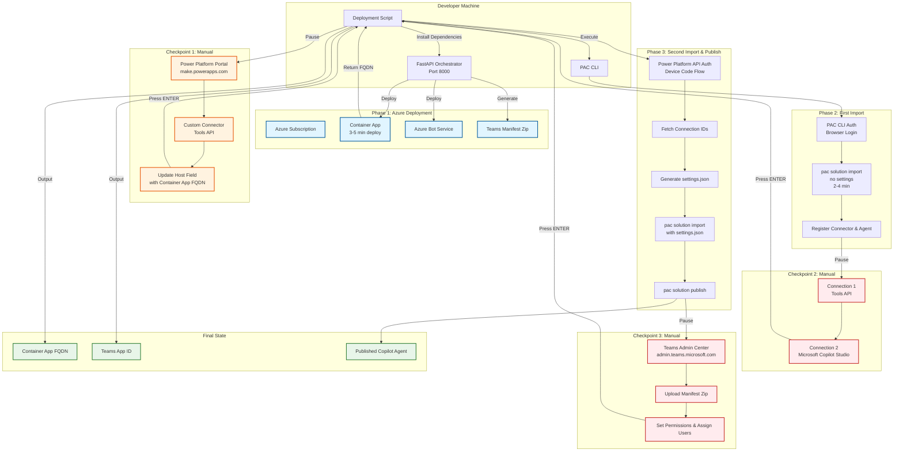

# Teams Copilot Agent Deployment Architecture

## Overview
This diagram illustrates the end-to-end deployment process for a Teams Copilot Agent, spanning Azure infrastructure, Power Platform, and Teams integration.

## Architecture Diagram

## Component Details

### Azure Infrastructure
- **Container App**: Hosts the FastAPI orchestrator, provides the API endpoint for the custom connector
- **Azure Bot Service**: Enables Teams bot functionality
- **Teams Manifest**: Zip file containing app configuration for Teams

### Power Platform Components
- **Custom Connector (Tools API)**: Bridges the Container App API to Power Platform
- **Copilot Agent**: The AI assistant built in Microsoft Copilot Studio
- **Connections**: Authentication links between the agent and external services

### Deployment Tools
- **FastAPI Orchestrator**: Local server that coordinates Azure deployment
- **PAC CLI**: Power Platform CLI for solution management
- **Deployment Script**: Orchestrates the entire process with pauses for manual steps

## Data Flow

1. **Phase 1**: Script deploys Azure resources, returns Container App FQDN
2. **Checkpoint 1**: User updates custom connector with the FQDN
3. **Phase 2**: PAC CLI imports solution (registers connector and agent)
4. **Checkpoint 2**: User creates two required connections
5. **Phase 3**: Script fetches connection IDs, generates settings, re-imports with bindings, publishes agent
6. **Checkpoint 3**: User uploads Teams manifest to Teams Admin Center
7. **Complete**: Agent is live with Teams app ID for future redeployments

## Error Handling

- **Phase 1 failures**: Check `orchestrator.log` and `orchestrator_err.log`
- **PAC CLI auth issues**: Run `pac auth clear` and re-authenticate
- **Missing connection IDs**: Verify connections exist in Power Platform before Phase 3

## Future Redeployments

Use the saved **Teams App ID** with the `-TeamsAppId` parameter to skip manifest creation and update the existing Teams app.
